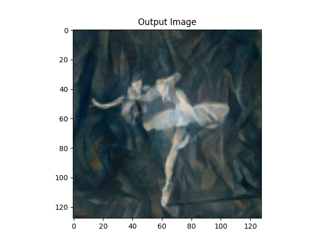
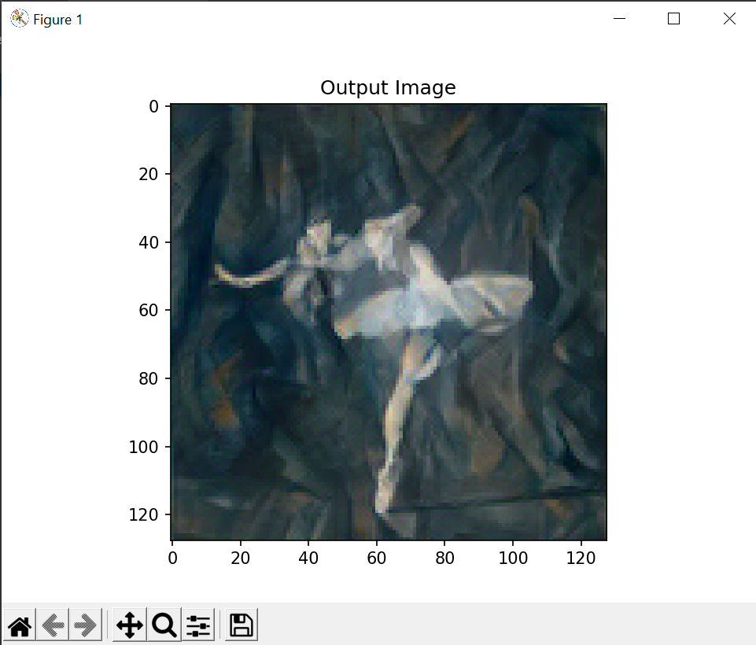

# Neural Style transferer
It's a package which allows you to apply style transfer on any image.

For example

That's my content image


And I want to apply the following style on it.


So the output will look more like this.



## Use of it is fairly straight forward.
1. Change the directory to NeuralStyleTranferer

```commandline
cd NeuralStyleTranferer
```

2. Pip install all the packages

```commandline
pip install -r requirements.txt
```

3. Go back

```commandline
cd ..
```

4. Just run the code

```commandline
python NeuralStyleTransferer/src/Model/run.py \
> --img_url "https://pytorch.org/tutorials/_static/img/neural-style/dancing.jpg" \
> --style_url "https://pytorch.org/tutorials/_static/img/neural-style/picasso.jpg"
```
or if you have your content img and style img stored locally
```commandline
python NeuralStyleTransferer/src/Model/run.py \
> --img_dir "dancing.jpg" \
> --style_dir "style.jpg"
```

Tadda the output



This code is open source, so it means you can use it however you like.

Also, if you want to see more in it, or you're having trouble using you better let me know

Follow me on

<a href ="https://twitter.com/alihassanrevel">
    
</a>
<a href="https://github.com/alihassanrevel">
    
</a>
<a href="https://www.youtube.com/channel/UCqRlg2jIdAhlUkU8GSZ0ixg">
    
</a>